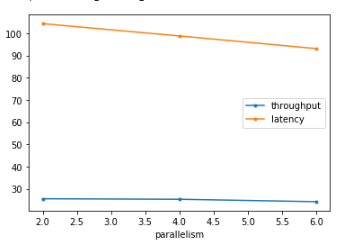
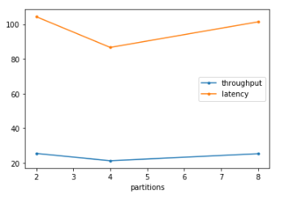

# How did changing values on the SparkSession property parameters affect the throughput and latency of the data?

I measured the performance based on inputRowsPerSecond and processedRowsPerSecond.

`throughput = processedRowsPerSecond [1/s]`

`latency = (1/processedRowsPerSecond-1/inputRowsPerSecond)*1000 [ms]`

I found that increasing the `parallelism` will decrease the latency, but it doesn't have to much impact on the throughput.

Changing the number of partitions has a positive effect on the latency up to a point, but choosing too high value can make things worst.
This parameter has similar effect on the throughput.

# What were the 2-3 most efficient SparkSession property key/value pairs? Through testing multiple variations on values, how can you tell these were the most optimal?

Based on my experiment I used the following parameters:

`"spark.default.parallelism": 6`

`"spark.sql.shuffle.partitions": 2`
